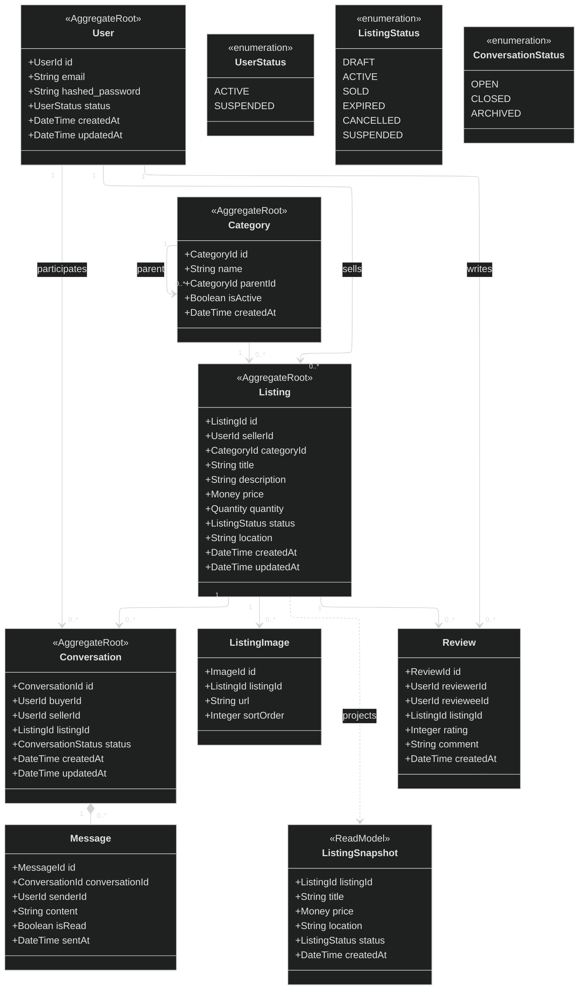

```mermaid
---
config:
  theme: dark
  layout: elk
---
classDiagram

%% ==========================================================
%% AGGREGATE ROOTS 
%% ==========================================================

class User {
    <<AggregateRoot>>
    +UserId id
    +String email
    +String hashed_password
    +UserStatus status
    +DateTime createdAt
    +DateTime updatedAt
}

class Listing {
    <<AggregateRoot>>
    +ListingId id
    +UserId sellerId
    +CategoryId categoryId
    +String title
    +String description
    +Money price
    +Quantity quantity
    +ListingStatus status
    +String location
    +DateTime createdAt
    +DateTime updatedAt
}

class Conversation {
    <<AggregateRoot>>
    +ConversationId id
    +UserId buyerId
    +UserId sellerId
    +ListingId listingId
    +ConversationStatus status
    +DateTime createdAt
    +DateTime updatedAt
}

class Category {
    <<AggregateRoot>>
    +CategoryId id
    +String name
    +CategoryId parentId
    +Boolean isActive
    +DateTime createdAt
}

%% ==========================================================
%% CHILD ENTITIES
%% ==========================================================

class ListingImage {
    +ImageId id
    +ListingId listingId
    +String url
    +Integer sortOrder
}

class Message {
    +MessageId id
    +ConversationId conversationId
    +UserId senderId
    +String content
    +Boolean isRead
    +DateTime sentAt
}

class Review {
    +ReviewId id
    +UserId reviewerId
    +UserId revieweeId
    +ListingId listingId
    +Integer rating
    +String comment
    +DateTime createdAt
}

%% ==========================================================
%% READ MODELS
%% ==========================================================

class ListingSnapshot {
    <<ReadModel>>
    +ListingId listingId
    +String title
    +Money price
    +String location
    +ListingStatus status
    +DateTime createdAt
}

%% ==========================================================
%% ENUMS
%% ==========================================================

class UserStatus {
    <<enumeration>>
    ACTIVE
    SUSPENDED
}

class ListingStatus {
    <<enumeration>>
    DRAFT
    ACTIVE
    SOLD
    EXPIRED
    CANCELLED
    SUSPENDED
}

class ConversationStatus {
    <<enumeration>>
    OPEN
    CLOSED
    ARCHIVED
}

%% ==========================================================
%% RELATIONSHIPS
%% ==========================================================

User "1" --> "0..*" Listing : sells
User "1" --> "0..*" Conversation : participates
User "1" --> "0..*" Review : writes

Listing "1" --> "0..*" ListingImage
Listing "1" --> "0..*" Conversation
Listing "1" --> "0..*" Review

Category "1" --> "0..*" Listing
Category "1" --> "0..*" Category : parent

Conversation "1" *-- "0..*" Message

Listing ..> ListingSnapshot : projects
```