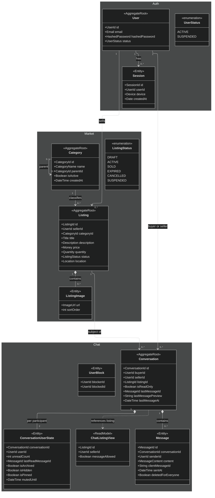

# Domain model

Cross-service view of **marketplace domain concepts** as implemented in Auth, Market, and Chat.  
Admin mirrors tables for staff UI; it does not define marketplace aggregates.  
Notification_dispatcher consumes events and sends email; it does not own domain aggregates.

---

## Bounded contexts

```text
┌──────────────────┐   ┌──────────────────┐   ┌──────────────────┐
│       Auth       │   │      Market      │   │       Chat       │
│                  │   │                  │   │                  │
│ User             │   │ Category         │   │ Conversation     │
│ Session          │   │ Listing          │   │ Message          │
│ VerificationToken│   │ ListingImage     │   │ ConversationUser │
│                  │   │                  │   │   State          │
│                  │   │                  │   │ UserBlock        │
└────────┬─────────┘   └────────┬─────────┘   └────────┬─────────┘
         │                      │                      │
         │ user_id              │ listing_id           │
         └──────────────────────┼──────────────────────┘
                                │ seller_id / buyer_id
                                ▼
                    ┌───────────────────────┐
                    │ notification_dispatcher│
                    │ (side effects: email) │
                    └───────────────────────┘
```

| Context | Core question |
|---------|----------------|
| **Auth** | Who is the user and may they authenticate? |
| **Market** | What can be sold, by whom, in what state? |
| **Chat** | How do buyer and seller communicate about a listing? |
| **Notifications** | Which domain facts trigger outbound email? |

Shared identifiers (`UserId`, `ListingId`) are **references**, not shared mutable models.

---

## Auth context

### Aggregates / entities

| Concept | Identity | Notes |
|---------|----------|--------|
| **User** | `UserId` (UUID v4) | Email + hashed password + status |
| **Session** | `SessionId` (UUID v4) | Bound to user + device; Redis in production |

### Value objects (selected)

| VO | Rules (summary) |
|----|-----------------|
| `Email` | Normalized, format-validated |
| `Password` / `HashedPassword` | Strength at boundary; hash never logged |
| `Device` | Non-empty device label |
| `UserStatus` | `ACTIVE` \| `SUSPENDED` |
| `VerificationToken` | UUID v4; purpose + TTL in token store |

### Important behaviors

- Signup creates user + session + tokens; publishes `UserRegistered`.
- Login fails opaquely on bad credentials; suspended users blocked; publishes `UserLoggedIn`.
- Logout revokes session; publishes `UserLoggedOut` (includes email when user can be loaded).
- Account deletion removes user and sessions; publishes `AccountDeleted`.
- Password / email verification tokens: unknown email is a **silent no-op** on reset request (no enumeration).

### Domain events (auth) → `auth.events`

| Event | Typical payload | Notifier action |
|-------|-----------------|-----------------|
| `UserRegistered` | `user_id`, `email` | Welcome email |
| `UserLoggedIn` | `user_id`, `email`, `session_id`, `device` | New login email |
| `UserLoggedOut` | `user_id`, `email`, `session_id`, `device` | Signed-out email |
| `AccountDeleted` | `user_id` | Temporary NOTHING |
| `VerificationTokenCreated` | `token`, `email`, `token_type` | Email token (`verifyemail` or `forget_pass_verify`) |

---

## Market context

### Aggregates / entities

| Concept | Identity | Notes |
|---------|----------|--------|
| **Category** | `CategoryId` | Optional parent; `is_active` gates new listings |
| **Listing** | `ListingId` | Owned by `seller_id`; price, quantity, location, status, images |
| **ListingImage** | Part of listing | URL + sort order |

### Listing status lifecycle

```text
                    ┌──────────┐
         publish    │  ACTIVE  │
        ┌──────────►│          ├──────► SOLD
        │           └────┬─────┘
        │                │
   ┌────┴───┐            ├──► CANCELLED
   │ DRAFT  │            ├──► EXPIRED
   └────────┘            └──► SUSPENDED
```

Transitions are enforced on the **Listing** aggregate. Inactive categories cannot accept new listings.

### Value objects (selected)

`Money`, `Quantity`, `Title`, `Description`, `Location`, `ListingStatus`, image URL / sort order.

### Domain events (market) → `listing.events`

| Event | Notifier action |
|-------|-----------------|
| `CategoryCreated` | Temporary NOTHING |
| `ListingCreated` | Temporary NOTHING |
| `ListingPublished` | Temporary NOTHING |
| `ListingStatusChanged` | Temporary NOTHING |
| `ListingUpdated` | Temporary NOTHING |
| `ListingDeleted` | Temporary NOTHING |

---

## Chat context

### Aggregates / entities

| Concept | Identity | Notes |
|---------|----------|--------|
| **Conversation** | `ConversationId` | One thread per **(buyer, listing)**; seller from listing |
| **Message** | `MessageId` | Soft-delete for everyone; idempotent `client_message_id` |
| **ConversationUserState** | `(conversation_id, user_id)` | Unread, archive, hide, pin, mute |
| **UserBlock** | `(blocker_id, blocked_id)` | Blocks messaging either way |

**Listing** in chat is a **remote read model** from market: `listing_id`, `seller_id`, `message_allowed` (ACTIVE).

### Conversation fields (not OPEN/CLOSED/ARCHIVED status)

| Field | Meaning |
|-------|---------|
| `is_read_only` | Frozen thread; no new messages |
| `last_message_id` / preview / at | Inbox denormalization |

Archive / hide / pin / mute live on **ConversationUserState**, not on a shared conversation status enum.

### Message

| Field | Meaning |
|-------|---------|
| `client_message_id` | UUID v4 idempotency key |
| `deleted_for_everyone` | Soft-delete; hidden from participant lists; retained for audit |
| `sent_at` | Delete window + cursor pagination |

### Important behaviors

- **Start conversation**: buyer + active listing; unique (buyer, listing).
- **Send message**: participant; not blocked; not read-only; idempotent client id.
- **Delete for everyone**: author + time window; may refresh last-message preview.
- **Mark listing unavailable** (admin identity): sets `is_read_only` on threads for that listing.

### Domain events (chat) → `chat.events`

| Event | Payload intent | Notifier action |
|-------|----------------|-----------------|
| `ConversationStarted` | IDs only | Temporary NOTHING |
| `MessageSent` | IDs only | Temporary NOTHING |

Realtime socket payloads (`message_sent` / `message_deleted`) are **not** broker domain events.

---

## Class diagram (implementation-aligned)



---

## Ubiquitous language

| Term | Meaning in Kologram |
|------|---------------------|
| **Listing** | Sellable offer owned by a seller under a category |
| **Publish** | Make a listing **ACTIVE** and discoverable |
| **Conversation** | Chat thread between buyer and seller for one listing |
| **Read-only conversation** | Frozen thread; no new messages |
| **Soft-delete (message)** | Hidden from participants; retained for audit |
| **Session** | Authenticated device-bound login in Auth |
| **Block** | User-level ban on messaging the other party |

---

## Explicit non-goals in the current model

| Concept | Status |
|---------|--------|
| Reviews / ratings | Not implemented |
| Conversation status OPEN/CLOSED/ARCHIVED | Replaced by `is_read_only` + per-user archive/hide |
| Message `isRead` on each row | Replaced by `ConversationUserState` cursors |
| Shared ListingSnapshot table | Chat fetches market GraphQL when needed |

When product enables more notifier jobs (e.g. `MessageSent` offline email), update the event matrix above without moving aggregate ownership.
