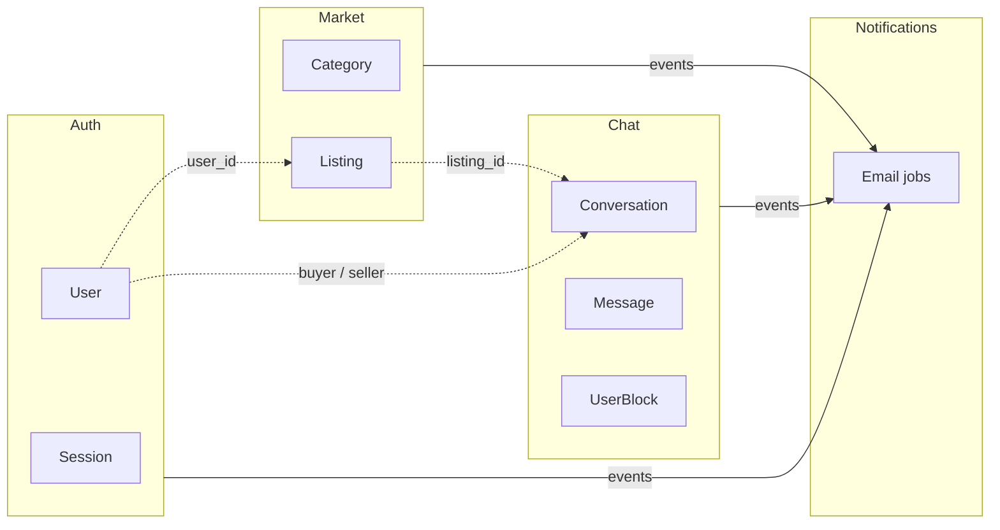
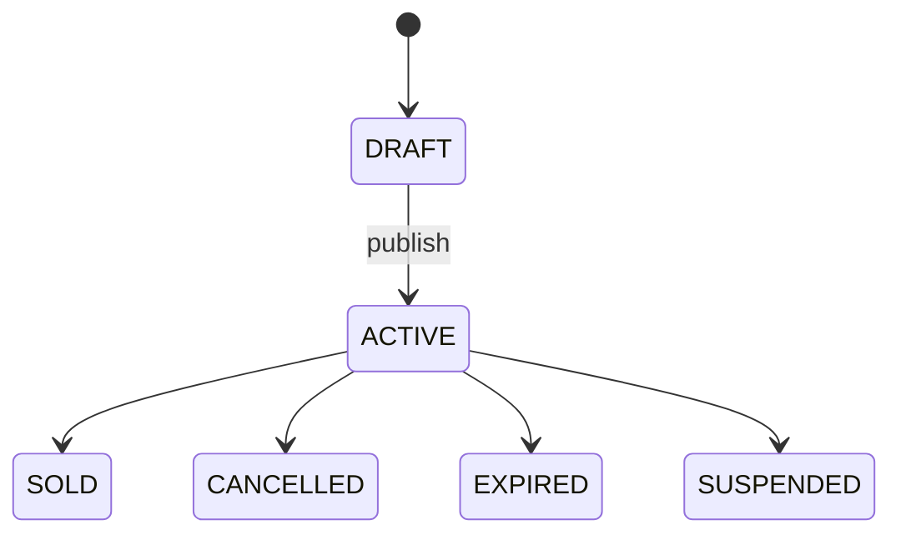
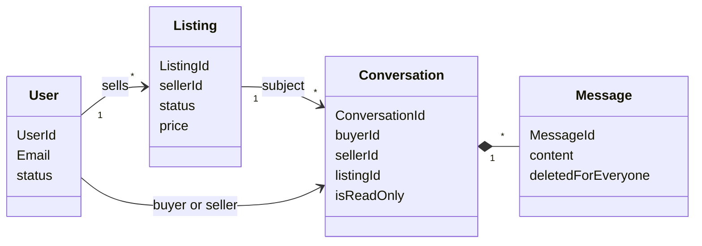

# Domain model

Bounded contexts and core concepts as implemented. Shared IDs are **references**, not shared aggregates.

---

## Context map

| Context | Question it answers |
|---------|---------------------|
| **Auth** | Who is the user; may they sign in? |
| **Market** | What is for sale, by whom, in what state? |
| **Chat** | How do buyer and seller talk about a listing? |
| **Notifications** | Which facts trigger email? (no domain ownership) |

Admin mirrors Auth/Market tables for staff; it does not define marketplace rules.

---

## Auth

| Concept | Notes |
|---------|--------|
| **User** | UUID id, email, hashed password, status (`ACTIVE` / `SUSPENDED`) |
| **Session** | Device-bound; stored in Redis (or memory in pure dev) |
| **VerificationToken** | UUID; email verify or password reset |

Behaviors: signup, login (opaque failures), logout, password reset, account delete. Events on `auth.events` (e.g. `UserRegistered`, `UserLoggedIn`, `VerificationTokenCreated`).

---

## Market

| Concept | Notes |
|---------|--------|
| **Category** | Optional parent; inactive categories block new listings |
| **Listing** | Seller-owned; price, quantity, location, status, images |

**Listing status**

Events on `listing.events` (created, published, status changed, updated, deleted, category created). Notifier currently no-ops these.

---

## Chat

| Concept | Notes |
|---------|--------|
| **Conversation** | One thread per (buyer, listing); seller from listing |
| **Message** | Soft-delete for everyone; idempotent `client_message_id` |
| **ConversationUserState** | Unread, archive, hide, pin, mute (per user) |
| **UserBlock** | Blocks messaging either way |

Listing in chat is a **read model** from market (`seller_id`, messaging allowed when ACTIVE). `is_read_only` freezes a thread; no OPEN/CLOSED conversation enum.

Events on `chat.events`: `ConversationStarted`, `MessageSent` (notifier no-op today). Realtime pushes on the socket are separate from broker events.

---

## Aggregates (compact)

---

## Language

| Term | Meaning |
|------|---------|
| Listing | Seller offer under a category |
| Publish | DRAFT → ACTIVE |
| Conversation | Chat for one buyer + listing |
| Soft-delete | Hidden from participants; kept for audit |
| Session | Authenticated device login |

---

## Explicit non-goals

Reviews/ratings · conversation OPEN/CLOSED/ARCHIVED status · per-message `isRead` column (use user-state cursors) · shared listing snapshot table in chat.
