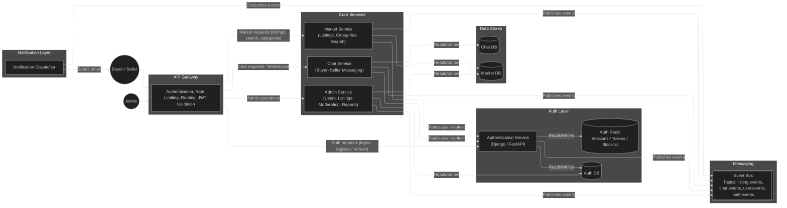

```mermaid
---
config:
  theme: dark
  layout: elk
---
flowchart LR
 subgraph Gateway["API Gateway"]
        GW["Authentication, Rate Limiting, Routing, JWT Validation"]
  end

 subgraph AuthLayer["Auth Layer"]
        AS["Authentication Service<br/>(Django / FastAPI)"]
        AuthDB[("Auth DB")]
        AuthRedis[("Auth Redis<br/>Sessions / Tokens / Blacklist")]
  end

 subgraph ServiceLayer["Core Services"]
        MS["Market Service<br/>(Listings, Categories, Search)"]
        CS["Chat Service<br/>(Buyer–Seller Messaging)"]
        AD["Admin Service<br/>(Users, Listings Moderation, Reports)"]
  end

 subgraph NotificationLayer["Notification Layer"]
        ND["Notification Dispatcher"]
  end

 subgraph DataStores["Data Stores"]
        MarketDB[("Market DB")]
        ChatDB[("Chat DB")]
  end

 subgraph Messaging["Messaging"]
        EB[["Event Bus<br/>Topics: listing.events,<br/>chat.events, user.events, notif.events"]]
  end

    User(("Buyer / Seller")) --> Gateway
    Admin(("Admin")) --> Gateway

    Gateway -- "Auth requests (login / register / refresh)" --> AS
    Gateway -- "Market requests (listings, search, categories)" --> MS
    Gateway -- "Chat requests / WebSocket" --> CS
    Gateway -- "Admin operations" --> AD

    AS -- Reads/Writes --> AuthDB
    AS -- Reads/Writes --> AuthRedis

    MS -- Reads/Writes --> MarketDB
    CS -- Reads/Writes --> ChatDB
    AD -- Reads/Writes --> MarketDB
    AD -- Reads/Writes --> AuthDB

    MS -- Publishes events --> EB
    CS -- Publishes events --> EB
    AS -- Publishes events --> EB
    AD -- Publishes events --> EB

    ND -- Consumes events --> EB
    ND -- Sends email --> User

    MS -- Reads user context --> AS
    CS -- Reads user context --> AS
```