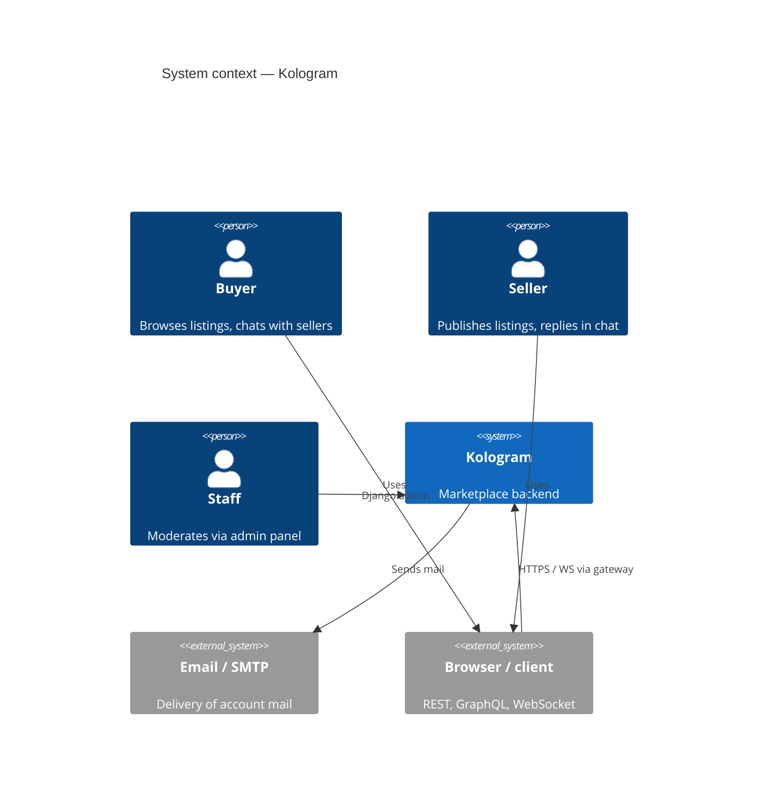
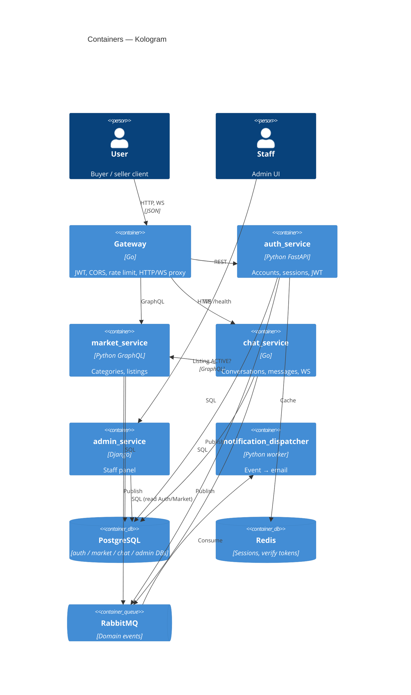

# High-level architecture

Marketplace platform: identity, catalog, messaging, staff admin, and outbound email.

---

## System context

Who uses the system and what sits outside it.



---

## Containers

Deployable units and infrastructure (one process or data store each).



| Container | Owns | Protocol |
|-----------|------|----------|
| gateway | Edge only | :8000 |
| auth_service | Users, sessions | REST :8001 |
| market_service | Categories, listings | GraphQL :8002 |
| chat_service | Conversations, messages, blocks | WS :8080 (host 8003) |
| admin_service | Staff UI (no domain ownership) | HTTP :8004 |
| notification_dispatcher | Idempotent email side-effects | Worker |

---

## Communication

**Synchronous**

| From | To | Why |
|------|-----|-----|
| Client | Gateway | Single public entry |
| Gateway | auth / market / chat | Proxy after JWT (public auth routes excepted) |
| chat | market GraphQL | Seller + `message_allowed` (listing ACTIVE) |

Identity: gateway validates access JWT, sets `X-User-Id` from `sub`, and `X-User-Admin: true` when claim `admin` is true. Client-supplied identity headers are stripped.

**Asynchronous (RabbitMQ topic)**

| Exchange | Publisher | Consumer |
|----------|-----------|----------|
| `auth.events` | auth | notification_dispatcher |
| `listing.events` | market | notification_dispatcher |
| `chat.events` | chat | notification_dispatcher |

Publish is **best-effort after commit** (not dual-write with the DB).

| Event | Email action today |
|-------|--------------------|
| UserRegistered, UserLoggedIn, UserLoggedOut | Send |
| VerificationTokenCreated | Send token |
| AccountDeleted, market events, ConversationStarted, MessageSent | Temporary no-op |

---

## Layering (product services)

```text
Presentation → Application → Domain
                              ↑ ports
                         Infrastructure
```

Admin is a thin multi-DB Django app. The notification worker uses trusted event DTOs → jobs → `EmailSender` (no domain validation of payloads).

---

## Local topology

| Host port | Target |
|-----------|--------|
| 8000 | gateway |
| 8001–8004 | auth, market, chat (mapped), admin |
| 5432 / 6379 / 5672 / 15672 | Postgres, Redis, RabbitMQ |

Chat schema: one-shot `chat_schema_init`. JWT keys: `auth_service/keys/`.

---

## Non-goals (current)

API gateway product features beyond JWT/CORS/rate-limit/proxy · reviews/ratings · rich HTML email templates · automatic freeze of chat from market status events (admin path exists on chat).
